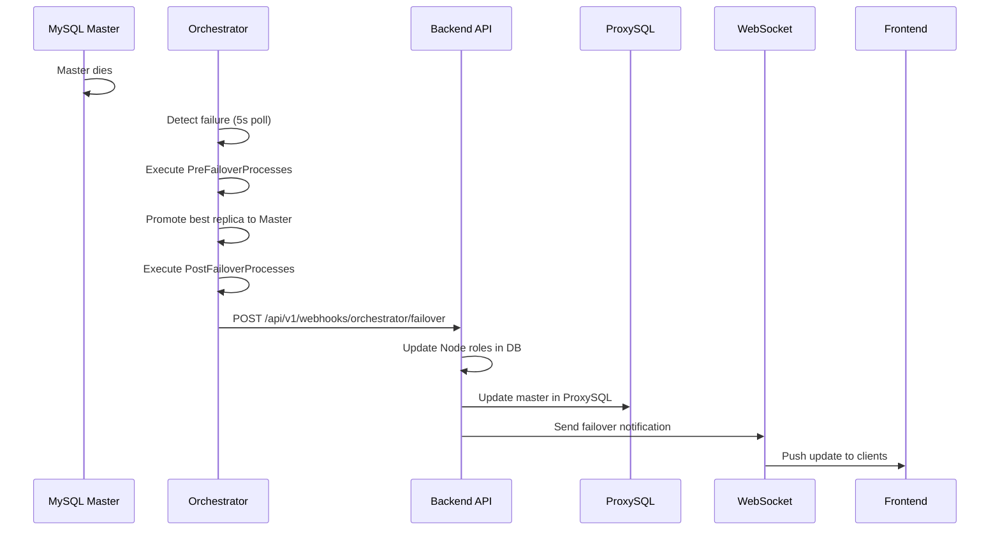

# Master Failover Workflow Report

> **Báo cáo phân tích chi tiết về quy trình failover khi Master chết trong DBaaS Platform**
>
> Ngày tạo: 2026-02-01

---

## Tổng quan

Hệ thống DBaaS Platform sử dụng **MySQL Orchestrator** để giám sát và tự động thực hiện failover khi Master node gặp sự cố. Workflow bao gồm nhiều thành phần phối hợp với nhau.



---

## Các thành phần chính

### 1. Orchestrator Configuration

📄 **File**: [orchestrator.conf.json](file:///home/vulee/idk/dbaas-platform/config/orchestrator.conf.json)

| Config Key                               | Value   | Mô tả                                      |
| ---------------------------------------- | ------- | ------------------------------------------ |
| `InstancePollSeconds`                    | 5       | Kiểm tra trạng thái mỗi 5 giây             |
| `RecoveryPeriodBlockSeconds`             | 60      | Block recovery trong 60s để tránh flapping |
| `RecoverMasterClusterFilters`            | `["*"]` | Enable failover cho tất cả cluster         |
| `ApplyMySQLPromotionAfterMasterFailover` | true    | Tự động promote replica                    |

**Failover Process Hooks:**

```json
"OnFailureDetectionProcesses": [
  "echo 'Detected {failureType} on {failureCluster}' >> /var/log/orchestrator/detection.log"
],
"PreFailoverProcesses": [
  "echo 'Starting failover for {failureCluster}' >> /var/log/orchestrator/failover.log"
],
"PostFailoverProcesses": [
  "echo 'Failover complete. New master: {successorHost}:{successorPort}' >> failover.log",
  "curl -X POST -d '{...}' http://host.docker.internal:8080/api/v1/webhooks/orchestrator/failover"
]
```

---

### 2. Webhook Controller

📄 **File**: [WebhookController.java](file:///home/vulee/idk/dbaas-platform/backend/src/main/java/com/dbaas/controller/WebhookController.java)

**Endpoint:** `POST /api/v1/webhooks/orchestrator/failover`

**Payload từ Orchestrator:**

```json
{
  "ClusterAlias": "mysql-{clusterId}",
  "SuccessorHost": "mysql-abc123-replica-1",
  "SuccessorPort": "3306",
  "FailedHost": "mysql-abc123-master",
  "FailureType": "DeadMaster"
}
```

**Workflow xử lý:**

```java
// 1. Parse cluster ID từ ClusterAlias
String clusterId = clusterAlias.replace("mysql-", "");

// 2. Update node statuses trong database
updateNodeStatuses(cluster, failedHost, successorHost);

// 3. Update ProxySQL configuration
proxySQLService.updateMaster(cluster, successorHost);

// 4. Send WebSocket notification
notificationService.notifyFailover(cluster, failedHost, successorHost);
```

---

### 3. Node Status Updates

📄 **File**: [WebhookController.java#L217-270](file:///home/vulee/idk/dbaas-platform/backend/src/main/java/com/dbaas/controller/WebhookController.java#L217-L270)

Phương thức `updateNodeStatuses()` thực hiện:

| Node           | Role Change      | Status Change | ReadOnly |
| -------------- | ---------------- | ------------- | -------- |
| **Old Master** | MASTER → REPLICA | → FAILED      | true     |
| **New Master** | REPLICA → MASTER | → RUNNING     | false    |

**Logic update Cluster entity:**

```java
// Cập nhật masterContainerId
cluster.setMasterContainerId(newMasterContainerId);

// Di chuyển containers giữa các danh sách
cluster.getReplicaContainerIds().add(oldMasterContainerId);  // Add failed master
cluster.getReplicaContainerIds().remove(newMasterContainerId); // Remove promoted replica
```

---

### 4. ProxySQL Update

📄 **File**: [ProxySQLService.java#L308-376](file:///home/vulee/idk/dbaas-platform/backend/src/main/java/com/dbaas/service/ProxySQLService.java#L308-L376)

Phương thức `updateMaster()` thực hiện 3 bước:

```sql
-- Step 1: Xóa old master (đã chết)
DELETE FROM mysql_servers WHERE hostname = 'mysql-{id}-master';

-- Step 2: Promote replica sang WRITE hostgroup
UPDATE mysql_servers
SET hostgroup_id = 10, weight = 1000
WHERE hostname = 'mysql-{id}-replica-1';

-- Step 3: Load và persist
LOAD MYSQL SERVERS TO RUNTIME;
SAVE MYSQL SERVERS TO DISK;
```

| Hostgroup ID | Purpose         | Weight |
| ------------ | --------------- | ------ |
| 10           | WRITE (Master)  | 1000   |
| 20           | READ (Replicas) | 500    |

---

### 5. Notifications

📄 **File**: [NotificationService.java#L75-96](file:///home/vulee/idk/dbaas-platform/backend/src/main/java/com/dbaas/service/NotificationService.java#L75-L96)

**WebSocket Notification:**

```json
{
  "type": "FAILOVER",
  "clusterId": "abc123",
  "clusterName": "prod-cluster",
  "oldMaster": "mysql-abc123-master",
  "newMaster": "mysql-abc123-replica-1",
  "timestamp": "2026-02-01T16:30:00Z"
}
```

**Destination:** `/topic/clusters/{clusterId}`

**External Notifications:**

- Telegram webhook via n8n (nếu configured)

---

## Timeline chi tiết

```mermaid
gantt
    title Failover Timeline
    dateFormat X
    axisFormat %s

    section Detection
    Master dies          :done, 0, 1
    Orchestrator detect  :active, 1, 6

    section Orchestrator
    PreFailover hook     :7, 8
    Replica promotion    :8, 12
    PostFailover hooks   :12, 14

    section Backend
    Receive webhook      :14, 15
    Update DB nodes      :15, 16
    Update ProxySQL      :16, 18
    Send notifications   :18, 19

    section Client
    WebSocket update     :19, 20
```



| Phase | Time (s) | Component    | Action                                      |
| ----- | -------- | ------------ | ------------------------------------------- |
| 0-5   | 0-5s     | Orchestrator | Polling Master, detect failure              |
| 5-10  | 5-10s    | Orchestrator | Confirm failure, start recovery             |
| 10-15 | 10-15s   | Orchestrator | Execute PreFailoverProcesses                |
| 15-20 | 15-20s   | MySQL        | Promote replica, reconfigure replication    |
| 20-25 | 20-25s   | Orchestrator | Execute PostFailoverProcesses, call webhook |
| 25-30 | 25-30s   | Backend      | Process webhook, update DB và ProxySQL      |
| 30+   | 30+s     | Frontend     | Receive WebSocket update                    |

**Estimated total failover time: 25-35 seconds**

---

## Luồng dữ liệu

```
┌─────────────────────────────────────────────────────────────────────────┐
│                          FAILOVER WORKFLOW                               │
├─────────────────────────────────────────────────────────────────────────┤
│                                                                          │
│  ┌─────────────┐                                                        │
│  │   Master    │ ──× DEAD                                               │
│  │  (Primary)  │                                                        │
│  └─────────────┘                                                        │
│         │                                                                │
│         ▼                                                                │
│  ┌─────────────┐                                                        │
│  │ Orchestrator│ ── Detects DeadMaster                                  │
│  │   :3000     │      │                                                 │
│  └─────────────┘      │                                                 │
│         │             │                                                 │
│         ▼             ▼                                                 │
│  ┌─────────────┐  ┌─────────────┐                                       │
│  │  Replica-1  │  │ PostFailover│                                       │
│  │  (PROMOTED) │  │   Webhook   │                                       │
│  └─────────────┘  └──────┬──────┘                                       │
│                          │                                              │
│                          ▼                                              │
│                   ┌─────────────┐                                       │
│                   │   Backend   │                                       │
│                   │   :8080     │                                       │
│                   └──────┬──────┘                                       │
│                          │                                              │
│         ┌────────────────┼────────────────┐                             │
│         ▼                ▼                ▼                             │
│  ┌─────────────┐  ┌─────────────┐  ┌─────────────┐                      │
│  │   MongoDB   │  │  ProxySQL   │  │  WebSocket  │                      │
│  │  (Update)   │  │  (Reconfig) │  │  (Notify)   │                      │
│  └─────────────┘  └─────────────┘  └──────┬──────┘                      │
│                                           │                             │
│                                           ▼                             │
│                                    ┌─────────────┐                      │
│                                    │  Frontend   │                      │
│                                    │  (Update)   │                      │
│                                    └─────────────┘                      │
│                                                                          │
└─────────────────────────────────────────────────────────────────────────┘
```

---
